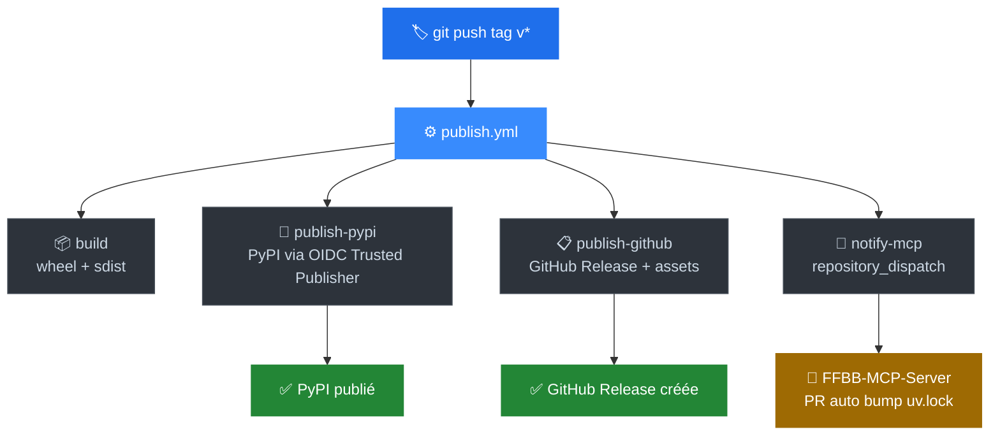

<div align="center">

# 🏀 FFBB API Python Client V3

**Le SDK Python moderne, typé et activement maintenu pour toutes les API et stats FFBB.**

[](https://pypi.org/project/ffbb_api_client_v3/)
[](https://pypi.org/project/ffbb_api_client_v3/)
[](https://github.com/nickdesi/FFBBApiClientV3/actions/workflows/ci.yml)
[](https://github.com/nickdesi/FFBBApiClientV3/actions/workflows/publish.yml)
[](https://pypi.org/project/ffbb_api_client_v3/)
[](LICENSE.txt)
[](CONTRIBUTING.rst)
[](https://github.com/nickdesi/FFBBApiClientV3/stargazers)

[🚀 Quick Start](#-quick-start) •
[✨ Fonctionnalités](#-fonctionnalités) •
[🔍 Meilisearch](#-9-index-meilisearch) •
[🤖 MCP / IA](#-intégration-ia--mcp) •
[🚢 Releases](#-pipeline-de-release) •
[🤝 Contribuer](#-contribuer)

---

> **English:** The actively maintained Python SDK for the French Basketball Federation (FFBB) APIs.
> Full rewrite of V2 — typed Pydantic models, async/sync, 9 Meilisearch indexes, HTTP caching, MCP-ready.

</div>

---

## ⚡ Pourquoi V3 ?

L'ancien client V2 est obsolète : `dict` bruts, tokens manuels, pas d'async, pas de cache. Pour chercher sur les 9 ressources FFBB, il fallait 9 appels séparés.

**V3 = refonte totale**, activement maintenue, pensée pour la production :

| Feature | V2 (obsolète) | V3 (ce SDK) | Gain |
|---|---|---|---|
| Types | `dict` bruts | **60+ modèles Pydantic v2** | 0 `KeyError` |
| Recherche | 9 requêtes | **1 `multi_search`** | **-88% latence** |
| Async | ❌ bloquant | **✅ natif** | **+300% vitesse I/O** |
| Cache | ❌ | **✅ HTTP `hishel`** | Quotas FFBB économisés |
| Tokens | Manuels | **`TokenManager` auto** | 0 erreur 401 |
| MCP / IA | ❌ | **✅ natif** | Claude/Cursor ready |

---

## 🚀 Quick Start

```bash
pip install ffbb_api_client_v3
```

```python
from ffbb_api_client_v3 import FFBBAPIClientV3, TokenManager

# Tokens publics FFBB auto-résolus
tokens = TokenManager.get_tokens()
client = FFBBAPIClientV3.create(
    api_bearer_token=tokens.api_token,
    meilisearch_bearer_token=tokens.meilisearch_token,
)

# Recherche typée — autocomplétion, zéro KeyError
clubs = client.search_organismes("Pau")
print(clubs.hits.nom)

# Lives en direct
lives = client.get_lives()

# Compétitions filtrées
comps = client.search_competitions("Pro A", sort=["libelle:asc"], limit=5)

# Async — FastAPI, agents IA, MCP
import asyncio
result = asyncio.run(client.search_organismes_async("Lyon"))
```

---

## ✨ Fonctionnalités

- 🏀 **API FFBB complète** — clubs, compétitions, saisons, poules, classements, lives
- 🔍 **9 index Meilisearch** — `filter`, `sort`, `limit` natifs sur toutes les méthodes
- ⚡ **Sync + Async** — chaque méthode disponible en `async/await`
- 🧩 **60+ modèles Pydantic v2** — type-safe, validation, sérialisation
- 📦 **Cache HTTP intégré** — SQLite ou mémoire via `hishel[async]`, configurable
- 🔄 **Retry + Timeout** — robustesse réseau out-of-the-box
- 🔐 **TokenManager intelligent** — auto-résolution + renouvellement transparent
- 🪵 **Logging sécurisé** — tokens masqués automatiquement dans les logs
- 🤖 **MCP-ready** — wrapper officiel pour Claude, Cursor, Copilot
- 🧪 **400+ tests** — unitaires + intégration, CI GitHub Actions

---

## 🔍 9 Index Meilisearch

```python
# 1 appel réseau → 9 index interrogés simultanément
results = client.multi_search("Clermont")

# Filtrage natif
organismes = client.search_organismes(
    "Clermont",
    filter=['codePostal = "63000"'],
    sort=["nom:asc"],
    limit=10,
)
```

| Index | Sync | Async | Description |
|---|---|---|---|
| `ffbbserver_organismes` | `search_organismes()` | `…_async()` | Clubs, comités, ligues |
| `ffbbserver_competitions` | `search_competitions()` | `…_async()` | Compétitions officielles |
| `ffbbserver_rencontres` | `search_rencontres()` | `…_async()` | Matchs et rencontres |
| `ffbbserver_salles` | `search_salles()` | `…_async()` | Salles et gymnases |
| `ffbbserver_pratiques` | `search_pratiques()` | `…_async()` | Lieux de pratique |
| `ffbbserver_terrains` | `search_terrains()` | `…_async()` | Terrains basket |
| `ffbbserver_tournois` | `search_tournois()` | `…_async()` | Tournois |
| `ffbbserver_engagements` | `search_engagements()` | `…_async()` | Engagements équipes ✨ v1.5 |
| `ffbbserver_formations` | `search_formations()` | `…_async()` | Formations & stages ✨ v1.5 |

---

## 🤖 Intégration IA / MCP

👉 **[FFBB MCP Server](https://github.com/nickdesi/FFBB-MCP-Server)** — le wrapper MCP officiel construit sur ce SDK.

Compatible **Claude Desktop**, **Cursor**, **Copilot**, et tout client [MCP](https://modelcontextprotocol.io/).

```bash
pip install ffbb-mcp-server
```

---

## ☁️ Production

### FastAPI

```python
from contextlib import asynccontextmanager
from fastapi import FastAPI, Request
from ffbb_api_client_v3 import FFBBAPIClientV3, TokenManager

@asynccontextmanager
async def lifespan(app: FastAPI):
    tokens = TokenManager.get_tokens()
    app.state.ffbb = FFBBAPIClientV3.create(
        api_bearer_token=tokens.api_token,
        meilisearch_bearer_token=tokens.meilisearch_token,
    )
    yield

app = FastAPI(lifespan=lifespan)

@app.get("/clubs/{ville}")
async def clubs(ville: str, request: Request):
    return await request.app.state.ffbb.search_organismes_async(ville)
```

### Docker

```dockerfile
FROM python:3.12-slim
WORKDIR /app
RUN pip install "ffbb_api_client_v3>=1.6.0"
COPY . .
CMD ["uvicorn", "main:app", "--host", "0.0.0.0", "--port", "8080"]
```

### Variables d'environnement

| Variable | Description | Requis |
|---|---|---|
| `API_FFBB_APP_BEARER_TOKEN` | Token API REST FFBB | Non (auto-résolu) |
| `MEILISEARCH_BEARER_TOKEN` | Token Meilisearch FFBB | Non (auto-résolu) |
| `FFBB_API_BASE_URL` | Override URL API REST | Non |
| `FFBB_MEILI_BASE_URL` | Override URL Meilisearch | Non |

---

## 🏗 Architecture

```text
src/ffbb_api_client_v3/
├── clients/
│   ├── ffbb_api_client_v3.py       # Façade — point d'entrée unique
│   ├── api_ffbb_app_client.py      # REST FFBB — clubs, poules, lives, saisons
│   └── meilisearch_ffbb_client.py  # Meilisearch — 9 index, search, multi_search
├── models/                         # ~60 modèles Pydantic v2 type-safe
├── helpers/                        # HTTP utils, multi-search, cache extension
├── utils/
│   ├── token_manager.py            # Auto-résolution et renouvellement des tokens
│   ├── cache_manager.py            # SQLite / mémoire via hishel, configurable
│   ├── retry_utils.py              # Retry + timeout configurable
│   └── secure_logging.py           # Masquage automatique des tokens dans les logs
└── config.py                       # URLs et constantes FFBB
```

---

## 🚢 Pipeline de Release

Un seul tag → tout publié automatiquement via GitHub Actions.

```bash
git tag v1.x.x
git push origin v1.x.x
```



> Le MCP Server se synchronise automatiquement dès que PyPI confirme la publication.
> Un fallback quotidien à 07:00 UTC assure la cohérence si la notification échoue.

---

## 🛠 Développement local

```bash
git clone https://github.com/nickdesi/FFBBApiClientV3.git
cd FFBBApiClientV3
pip install -e ".[testing]"

pytest tests/ --cov=src -v   # tests complets
tox                           # identique CI GitHub Actions
```

---

## 🚑 Troubleshooting

<details>
<summary><strong>401 Unauthorized / Forbidden</strong></summary>

Les tokens FFBB expirent. Forcer un renouvellement :

```python
from ffbb_api_client_v3 import TokenManager
tokens = TokenManager.get_tokens(use_cache=False)
```
</details>

<details>
<summary><strong>Pydantic ValidationError — champ manquant</strong></summary>

L'API FFBB évolue. Mettre à jour le package :

```bash
pip install --upgrade ffbb_api_client_v3
```
</details>

<details>
<summary><strong>Données en cache périmées</strong></summary>

```python
from ffbb_api_client_v3.utils.cache_manager import CacheManager
CacheManager().clear()
```
</details>

---

## 🤝 Contribuer

**Signaler un bug** → [ouvrir une issue](https://github.com/nickdesi/FFBBApiClientV3/issues)
**Proposer une feature** → [discussions](https://github.com/nickdesi/FFBBApiClientV3/discussions)
**Soumettre un PR** → [guide de contribution](CONTRIBUTING.rst)

```bash
git checkout -b feat/ma-feature
# code, tests, commit
git push origin feat/ma-feature
# → Pull Request
```

Tout PR avec tests est accepté en revue dans les **48h**.

---

## 🗺 Roadmap

- [ ] Documentation ReadTheDocs complète
- [ ] CLI intégrée — `ffbb search "Pau Orthez"`
- [ ] Exemples avancés — classements, stats équipes, analyse de saison
- [ ] Streaming lives en temps réel
- [ ] Support Python 3.13

---

## 📋 Changelog

Voir [CHANGELOG.md](CHANGELOG.md) pour l'historique complet.

**v1.6.0 —** Pipeline de release automatisé — PyPI Trusted Publisher OIDC, GitHub Release avec notes auto-générées, synchronisation FFBB-MCP-Server via `repository_dispatch`.

**v1.5.x —** `search_engagements()`, `search_formations()`, filtrage natif `filter/sort/limit`, logging sécurisé, +150 tests.

---

## 📄 Licence

[Apache 2.0](LICENSE.txt) — utilisation libre, y compris commerciale.

---

<div align="center">

Fait pour la communauté basketball française et les développeurs qui n'ont pas envie de réinventer la roue.

**Si ce projet t'aide, une étoile fait toute la différence. ⭐**

[](https://github.com/nickdesi/FFBBApiClientV3/stargazers)
[](https://github.com/nickdesi/FFBBApiClientV3/network/members)

</div>
